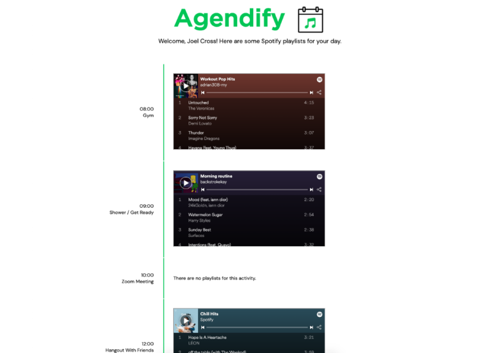

# AGENDIFY: Tunes For Your Daily Routine
Agendify is a webapp which uses the Google Calendar API to access your calendar and provide appropriate Spotify playlists for the activities scheduled.

## How To Use
To run Agendify on your own device, clone this repo and run `python -m http.server 8000` in your command prompt within the Agendify directory. 
Then, navigate to `http://localhost:8000` in your browser, click "authorize' and log into your Google account.

## How It Works
Agendify is coded in JavaScript, HTML, and CSS. The JavaScript acesses the Google Calendar API and provides an Authentication method for the user to log into their personal Google account. The HTML structures the web page/runs the JavaScript and the CSS styles the webpage.
